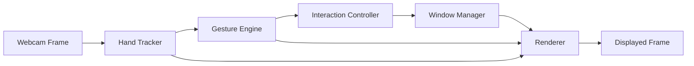
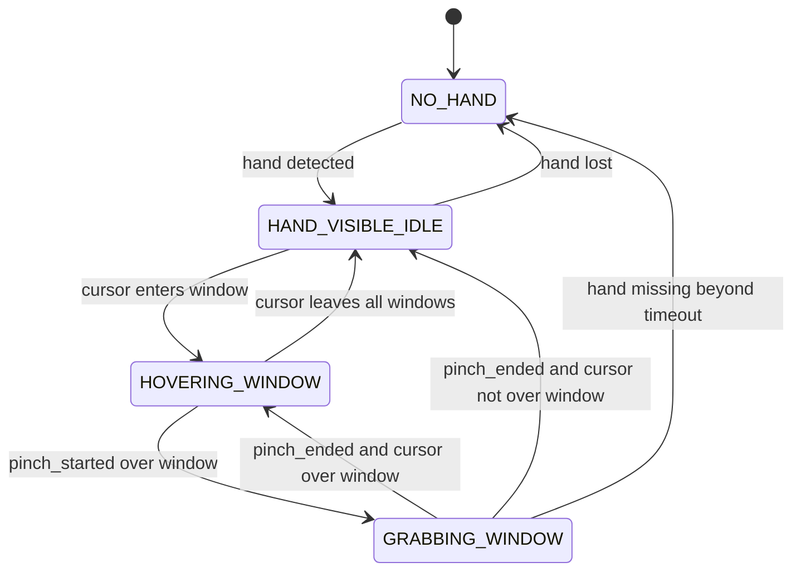

# AirDesk

Gesture-controlled virtual monitor system for spatial interaction using a standard webcam.

## Status

This repository now has the initial project scaffold plus the first two runtime milestones:

1. Package structure, configuration models, and state models are in place
2. The application can open a webcam stream, mirror frames, display them in an OpenCV window, and shut down cleanly
3. MediaPipe hand tracking is wired in, with one-hand landmark overlays and a minimal debug HUD
4. A smoothed fingertip cursor now follows the index finger, with raw versus smoothed positions shown in the debug HUD
5. Pinch detection now exposes stable start, hold, and end signals using hand-size normalized thresholds with hysteresis
6. A styled in-app virtual window now renders with idle and hover states driven by cursor hit-testing
7. Pinch-to-grab now moves the virtual window with preserved grab offset and releases it cleanly in place
8. The in-app prototype now supports multiple overlapping panels with frontmost selection and z-order updates while dragging
9. A first system-control architecture now exists behind `--mode system-shadow`, translating gestures into backend-agnostic pointer intents without touching the real OS yet
10. Experimental live macOS cursor control now exists behind `--mode system-macos --enable-system-actions`, with a runtime `S` arm/disarm safety toggle
11. System-control modes now use an open-palm clutch plus a short pinch debounce, with calmer pointer shaping for safer live control
12. Live macOS control now includes a focused-window move mode behind `W`, letting you pinch-drag the current external window through Accessibility APIs
13. Window mode can now lock a target behind `C`, so the chosen app window stays controllable even after AirDesk regains focus
14. Window mode now supports `R` to switch between move and resize, plus left, right, and top-edge snapping for real macOS windows
15. Pointer mode now treats a quick thumb-index tap as a click, while a held pinch still becomes drag

At this point the in-app interaction prototype is functionally complete, and the macOS system-control layer covers real pointer control plus early window movement, resizing, and snapping. The remaining work is polish, tuning, and broader desktop integration.

The rest of this README remains the implementation plan for the next milestones.

## Vision

AirDesk explores spatial computing with commodity hardware. A user stands or sits in front of a laptop webcam, sees their hand tracked in real time, and manipulates floating virtual windows using natural gestures such as pointing and pinching.

The first version is intentionally scoped as an in-app prototype rather than a full operating system controller. The goal is to make the interaction feel intuitive, stable, and visually compelling before expanding into desktop integration or two-hand gestures.

## MVP Goals

The MVP should support the following end-to-end flow:

1. Open the webcam feed in a desktop application window.
2. Detect and render one hand using MediaPipe Hands.
3. Use the index fingertip as a visible cursor.
4. Detect a pinch gesture using thumb and index finger distance.
5. Render one or more virtual windows over the camera feed.
6. Allow the user to pinch over a window to grab it.
7. Move the grabbed window smoothly while the pinch is held.
8. Drop the window in place when the pinch is released.

## Non-Goals For MVP

The following are explicitly out of scope for the first version:

1. Broad keyboard automation or shortcut injection
2. Two-hand resizing or rotation
3. Depth-aware interaction or 3D positioning
4. Gesture-created or gesture-deleted windows
5. Layout memory beyond the current live session
6. Full pose classification for every finger shape

## Design Principles

1. Reliability over novelty
2. Fast feedback over visual complexity
3. Simple state transitions over ambiguous gesture logic
4. Extendable architecture over premature abstraction
5. In-app virtual windows before any OS-level integration

## User Experience Summary

The user sees a mirrored webcam feed with floating panels overlaid on top. A small cursor follows the index fingertip. When the user pinches over a panel, that panel becomes active, highlights visually, and follows the hand until the pinch is released.

The intended feeling is not "debugging a hand tracker." It should feel like touching lightweight digital surfaces in space.

## Technical Stack

1. Python
2. OpenCV for webcam input, frame display, and 2D rendering
3. MediaPipe Hands for landmark detection
4. Optional later: PyAutoGUI for experimentation with cursor control

## Local Setup

Once implementation begins, the intended local setup flow is:

```bash
python3.12 -m venv .venv
source .venv/bin/activate
pip install -e .[dev]
```

This repository now includes a `pyproject.toml` scaffold so dependencies and developer tooling can be installed from a single entry point.
Use Python 3.11 or 3.12 for now; the current `mediapipe` release used by AirDesk does not advertise Python 3.13 or 3.14 support on PyPI.
Because AirDesk is a webcam desktop app, run it from a local GUI session and allow camera access when macOS prompts for it.

Useful local commands:

```bash
pytest
python -m airdesk.main
python -m airdesk.main --hide-debug-hud
python -m airdesk.main --camera-index 1
python -m airdesk.main --mode system-shadow
python -m airdesk.main --mode system-macos --enable-system-actions
```

For live macOS control, AirDesk starts safely disarmed unless you also pass `--start-armed`. While the app is running, press `S` to arm or disarm live system actions, press `W` to switch between pointer mode and focused-window mode, press `R` in window mode to switch between move and resize, and press `C` in window mode to lock or clear the current target window. In pointer mode, a quick thumb-index tap clicks and a held pinch drags. The first successful window action also locks that target automatically, and dragging a window to the left, right, or top edge will snap it on release. macOS Accessibility permission is required for the Python process or terminal that launches the app.

## System Overview

AirDesk is organized into five runtime layers:

1. Input layer
2. Perception layer
3. Gesture layer
4. Interaction/state layer
5. Rendering layer



## Runtime Pipeline

Each frame follows the same high-level pipeline:

1. Capture frame from webcam
2. Mirror frame horizontally
3. Run MediaPipe hand tracking
4. Extract relevant landmarks
5. Compute gesture state from landmark geometry
6. Update interaction state and window positions
7. Render overlays, windows, cursor, and hand landmarks
8. Display frame

This keeps the system event-driven at the frame level while preserving a simple mental model.

## Recommended Project Structure

This is the proposed implementation layout once coding begins:

```text
airdesk/
  main.py
  app.py
  config.py
  models/
    hand.py
    gesture.py
    window.py
    interaction.py
  vision/
    camera.py
    hand_tracker.py
  gestures/
    gesture_engine.py
    filters.py
  core/
    window_manager.py
    interaction_controller.py
  ui/
    renderer.py
    theme.py
```

This structure keeps perception, gesture interpretation, application state, and drawing responsibilities separate.

## Core Components

### 1. Camera Module

Responsibilities:

1. Open the default webcam
2. Read frames continuously
3. Mirror frames for natural interaction
4. Expose frame width and height
5. Handle graceful shutdown

Inputs:

1. Camera device index
2. Requested resolution

Outputs:

1. Current frame
2. Frame dimensions
3. Capture success flag

### 2. Hand Tracker

Responsibilities:

1. Run MediaPipe Hands on each frame
2. Return one-hand landmark data for MVP
3. Convert normalized coordinates into pixel coordinates
4. Estimate a simple hand scale for normalized gesture thresholds
5. Surface tracking confidence and visibility

Inputs:

1. Mirrored frame

Outputs:

1. `hand_detected`
2. `landmarks_normalized`
3. `landmarks_px`
4. `hand_scale`
5. `confidence`

### 3. Gesture Engine

Responsibilities:

1. Derive cursor position from index fingertip
2. Smooth cursor motion
3. Detect pinch start, hold, and end
4. Apply hysteresis to avoid flicker
5. Expose gesture state as stable app signals rather than raw geometry

Inputs:

1. Landmark positions
2. Hand scale estimate
3. Previous gesture state

Outputs:

1. `cursor_px`
2. `pinch_ratio`
3. `pinch_active`
4. `pinch_started`
5. `pinch_ended`
6. `tracking_stable`

### 4. Interaction Controller

Responsibilities:

1. Determine which window is hovered
2. Start a grab when a pinch begins over a window
3. Maintain grab offset during dragging
4. Release a window when the pinch ends
5. Handle temporary hand loss with a short grace window

Inputs:

1. Gesture state
2. Window manager state
3. Previous interaction state

Outputs:

1. Updated interaction state
2. Updated window positions and flags

### 5. Window Manager

Responsibilities:

1. Store the authoritative list of virtual windows
2. Perform hit-testing against the cursor
3. Maintain z-order
4. Bring active window to front
5. Clamp movement within visible bounds

Inputs:

1. Window collection
2. Cursor position
3. Frame bounds

Outputs:

1. Hovered window id
2. Grabbed window id
3. Updated window list

### 6. Renderer

Responsibilities:

1. Draw the mirrored camera frame
2. Draw virtual windows and visual states
3. Draw the cursor
4. Draw hand landmarks and connections
5. Draw optional debug HUD

Inputs:

1. Frame
2. Hand state
3. Gesture state
4. Window state
5. Interaction state

Outputs:

1. Final composited display frame

## Data Model

These models are conceptual. They define the state we expect the runtime to maintain.

### HandState

```text
HandState
- detected: bool
- confidence: float
- landmarks_px: dict[int, (x, y)]
- index_tip: (x, y)
- thumb_tip: (x, y)
- palm_center: (x, y)
- hand_scale: float
- last_seen_time: float
```

### GestureState

```text
GestureState
- cursor_px: (x, y)
- raw_cursor_px: (x, y)
- pinch_ratio: float
- pinch_active: bool
- pinch_started: bool
- pinch_ended: bool
- tracking_stable: bool
```

### VirtualWindow

```text
VirtualWindow
- id: str
- title: str
- x: int
- y: int
- width: int
- height: int
- z_index: int
- state: idle | hovered | grabbed
```

### InteractionState

```text
InteractionState
- hovered_window_id: str | None
- grabbed_window_id: str | None
- grab_offset_x: float
- grab_offset_y: float
- hand_missing_since: float | None
```

## Coordinate System

The system should use a single primary coordinate space for interaction and rendering:

1. MediaPipe returns normalized landmark coordinates
2. Landmarks are converted into pixel coordinates using the displayed frame dimensions
3. All hit-testing, cursor logic, and window movement use pixel coordinates

This avoids coordinate mismatch bugs and keeps rendering logic simple.

## Gesture Definitions

### Cursor

For MVP, the cursor is always the smoothed index fingertip position.

Reasoning:

1. It is easy to understand
2. It avoids brittle finger-pose classification
3. It still produces a strong "pointing" illusion

### Pinch

Pinch should be based on normalized distance, not raw pixel distance.

Recommended formula:

```text
pinch_ratio = distance(thumb_tip, index_tip) / hand_scale
```

Possible `hand_scale` candidates:

1. Wrist to middle-finger MCP distance
2. Palm width across landmark bases
3. Distance between index MCP and pinky MCP

For MVP, a palm-width style measure is likely the most intuitive and stable.

### Pinch Hysteresis

Use separate thresholds for entering and exiting the pinch state:

```text
pinch_on_threshold  <  pinch_off_threshold
```

Example starting values:

```text
pinch_on_threshold  = 0.30
pinch_off_threshold = 0.40
```

This prevents rapid on-off flicker near the threshold.

### Cursor Smoothing

Cursor movement should use a simple low-latency smoothing filter such as an exponential moving average.

Conceptually:

```text
smoothed = alpha * current + (1 - alpha) * previous
```

Initial recommendation:

```text
cursor_smoothing_alpha = 0.40
```

Too much smoothing makes the cursor feel delayed. Too little makes it jittery.

## Interaction Model

### Hover Rule

A window is hovered if the cursor lies within its bounds. If multiple windows overlap, the highest z-index window wins.

### Grab Rule

A grab starts only when:

1. `pinch_started` is true
2. The cursor is inside a window
3. No other window is currently grabbed

When a grab starts:

1. The selected window becomes active
2. The selected window is brought to the front
3. The system stores the offset between the cursor and the window origin

The grab offset is critical because it prevents the window from snapping its top-left corner directly to the fingertip.

### Move Rule

While a window is grabbed and the pinch remains active:

1. New window position is computed from cursor position minus stored grab offset
2. Position is clamped to remain reachable on screen

### Release Rule

When `pinch_ended` becomes true:

1. The grabbed window returns to idle state
2. The window remains at its latest position
3. Grab state is cleared

### Hand-Loss Rule

If the hand disappears temporarily during a grab:

1. Do not instantly release on the first bad frame
2. Start a short grace timer
3. Force release only if the hand remains missing past the timeout

Recommended starting value:

```text
hand_loss_timeout_ms = 150
```

## Interaction State Machine



This state machine is intentionally small. The goal is stable interaction, not gesture complexity.

## Window System Specification

### Window Rules

1. Multiple windows are allowed
2. Only one window can be grabbed at a time
3. Entire window surface is draggable in MVP
4. Grabbed window moves to the front
5. Windows may overlap
6. Windows should remain at least partially visible

### Visual States

Each window has one of three visual states:

1. `idle`
2. `hovered`
3. `grabbed`

Recommended treatment:

1. `idle`: neutral border, translucent fill
2. `hovered`: brighter border, slightly stronger emphasis
3. `grabbed`: accent border, stronger highlight, clearer active state

## Rendering Specification

### Draw Order

The renderer should draw in the following order:

1. Mirrored webcam frame
2. Window shadows or background accents
3. Virtual windows
4. Cursor
5. Hand landmarks and connections
6. Debug HUD

### Visual Guidelines

1. Windows should remain legible over varied webcam backgrounds
2. Cursor should be easy to locate instantly
3. Thumb tip and index tip can be accent-colored for debugging
4. Landmark lines should be informative but not overpower the UI
5. Active feedback should be obvious without reading text

## Main Loop Outline

The runtime loop should roughly follow this structure:

```text
initialize config
initialize webcam
initialize MediaPipe Hands
initialize window manager with seed windows
initialize gesture and interaction state

while app is running:
    read frame
    mirror frame
    detect hand landmarks
    build hand state
    derive gesture state
    update interaction state
    update windows
    render frame and overlays
    display output
    handle exit input

release webcam
destroy windows
```

This gives the project a clear single-threaded baseline. Concurrency should not be introduced unless profiling proves it necessary.

## Configuration Surface

These values should be centralized in a config module so they can be tuned quickly:

```text
camera_index = 0
frame_width = 640
frame_height = 480

min_detection_confidence = 0.60
min_tracking_confidence = 0.60
max_num_hands = 1

cursor_smoothing_alpha = 0.40
pinch_on_threshold = 0.30
pinch_off_threshold = 0.40
hand_loss_timeout_ms = 150

window_border_thickness = 2
window_corner_radius = 8
cursor_radius = 8
show_debug_hud = true
```

These values are starting points, not final tuned settings.

## Performance Targets

The MVP should prioritize interaction quality over maximum fidelity.

Target characteristics:

1. Real-time responsiveness
2. Stable visual feedback
3. Comfortable interaction at approximately 20 to 30 FPS or higher
4. Low enough latency that dragging feels direct

Initial performance strategy:

1. Track one hand only
2. Start at `640x480`
3. Keep rendering lightweight
4. Avoid unnecessary per-frame object creation where possible

## Edge Cases

### No Hand Visible

Behavior:

1. Cursor is hidden or visually de-emphasized
2. Windows remain unchanged
3. If grabbing, release only after the timeout

### Pinch Outside Any Window

Behavior:

1. No grab begins
2. Cursor continues updating normally

### Overlapping Windows

Behavior:

1. Hover selects the frontmost window
2. Grab brings the selected window to the front

### Tracking Jitter

Behavior:

1. Smoothing reduces visible noise
2. Hysteresis reduces pinch flicker
3. Debug HUD surfaces unstable values for tuning

### Temporary Landmark Loss

Behavior:

1. Grace timeout prevents accidental drops
2. If timeout expires, active grab is released safely

## Milestone Plan

### Milestone 1: Camera Baseline

Deliverable:

1. Desktop app window with mirrored webcam feed

Validation:

1. Webcam opens reliably
2. Display loop is stable
3. Application closes cleanly

### Milestone 2: Hand Tracking Overlay

Deliverable:

1. Single-hand landmark and connection rendering

Validation:

1. Landmarks appear consistently
2. Hand loss and reacquisition work predictably

### Milestone 3: Cursor Tracking

Deliverable:

1. Smoothed index fingertip cursor

Validation:

1. Cursor follows hand clearly
2. Jitter is reduced without excessive lag

### Milestone 4: Pinch Detection

Deliverable:

1. Stable pinch start, hold, and end signals

Validation:

1. Pinch ratio is readable in debug HUD
2. Hysteresis prevents unstable toggling

### Milestone 5: Single Window Rendering

Deliverable:

1. One styled virtual window with idle and hover states

Validation:

1. Hover detection works
2. Visual states are easy to distinguish

### Milestone 6: Grab and Move

Deliverable:

1. Pinch-to-grab window movement

Validation:

1. Grab starts only on window hit
2. Window follows the hand smoothly
3. Release drops the window in place

### Milestone 7: Multiple Windows

Deliverable:

1. Multiple draggable windows with z-order support

Validation:

1. Overlap handling feels intuitive
2. Topmost window is correctly selected

### Milestone 8: Visual and Interaction Polish

Deliverable:

1. Improved styling, stability, and tuning

Validation:

1. Demo is understandable without explanation
2. Interaction feels deliberate rather than experimental

## Milestone 1-3 Implementation Checklist

The first three milestones are the minimum slice needed to prove the interaction stack. This section breaks them into concrete tasks and maps those tasks to the proposed modules.

### Milestone 1: Camera Baseline

Primary files:

1. `airdesk/config.py`
2. `airdesk/app.py`
3. `airdesk/main.py`
4. `airdesk/vision/camera.py`

Tasks:

1. Define central configuration objects for camera, tracking, gestures, and rendering
2. Create the application entry point and lifecycle wrapper
3. Implement webcam open, frame read, and clean shutdown behavior
4. Mirror frames horizontally before display
5. Add quit-key handling and basic runtime status messages
6. Confirm the display loop can maintain stable frame updates

Definition of done:

1. `python -m airdesk.main` launches the app
2. Webcam feed renders in a mirrored view
3. Closing the app releases camera resources cleanly

### Milestone 2: Hand Tracking Overlay

Primary files:

1. `airdesk/models/hand.py`
2. `airdesk/vision/hand_tracker.py`
3. `airdesk/ui/renderer.py`
4. `airdesk/ui/theme.py`

Tasks:

1. Wrap MediaPipe Hands in a dedicated tracker module
2. Convert normalized landmarks into pixel-space coordinates
3. Build a `HandState` model for the tracked hand
4. Choose a consistent primary hand for MVP when multiple detections occur
5. Render hand landmarks and skeletal connections over the mirrored frame
6. Add minimal debug text for hand visibility and confidence

Definition of done:

1. One hand is tracked reliably in typical lighting
2. Landmarks and connections remain aligned with the mirrored frame
3. Hand loss and reacquisition do not crash or stall the app

### Milestone 3: Cursor Tracking

Primary files:

1. `airdesk/models/gesture.py`
2. `airdesk/gestures/filters.py`
3. `airdesk/gestures/gesture_engine.py`
4. `airdesk/ui/renderer.py`

Tasks:

1. Extract index fingertip coordinates from `HandState`
2. Add low-latency cursor smoothing
3. Build a `GestureState` model to expose raw and smoothed cursor positions
4. Render a visible cursor marker at the fingertip location
5. Decide behavior for cursor visibility when tracking is lost
6. Add debug output for raw versus smoothed cursor position during tuning

Definition of done:

1. Cursor follows the index finger clearly
2. Cursor jitter is reduced without noticeable lag
3. Temporary tracking loss degrades gracefully and recovers cleanly

### Recommended Delivery Order

1. Finish the camera loop first, even if the rest of the app is stubbed
2. Integrate MediaPipe next and validate landmark quality before polishing rendering
3. Add cursor smoothing only after seeing raw fingertip behavior
4. Delay pinch and window logic until cursor behavior feels credible

## Testing Strategy

The MVP does not require a heavy formal test suite on day one, but it does need structured validation.

### Manual Functional Tests

1. Open app and verify webcam feed
2. Raise one hand and verify landmarks
3. Move index finger and verify cursor tracking
4. Pinch and verify state transitions
5. Pinch over a window and verify grab
6. Move hand while pinching and verify smooth drag
7. Release pinch and verify stable drop
8. Reacquire after temporary hand loss

### Tuning Tests

1. Test under bright and dim lighting
2. Test at different distances from camera
3. Test slow movements and fast movements
4. Test small and large hand motions
5. Test overlapping windows

### Instrumentation

Helpful runtime diagnostics:

1. FPS
2. Pinch ratio
3. Pinch state
4. Hovered window id
5. Grabbed window id
6. Hand detected flag

## Risks And Mitigations

### Risk: Cursor Jitter

Mitigation:

1. Exponential smoothing
2. Landmark confidence gating

### Risk: False Pinch Detection

Mitigation:

1. Hand-size normalized thresholds
2. Separate on and off thresholds

### Risk: Unstable User Experience During Hand Loss

Mitigation:

1. Short hand-loss grace period
2. Safe forced release after timeout

### Risk: Prototype Feels Like A Debug Tool

Mitigation:

1. Strong visual state design
2. Clean overlay composition
3. Clear cursor and active window styling

### Risk: Architecture Becomes Hard To Extend

Mitigation:

1. Separate gesture interpretation from interaction logic
2. Keep models explicit and stateful
3. Centralize tunable config values

## Future Extensions

After the MVP is stable, possible next steps include:

1. Two-hand pinch for resizing
2. Dedicated title bar dragging and edge resizing
3. Gesture shortcuts such as swipe-to-switch layouts
4. Snap-to-grid window placement
5. Multi-hand or multi-user experiments
6. Real desktop cursor or window integration
7. Depth estimation from hand scale changes

## Success Criteria

The MVP is successful when:

1. Hand landmarks are visible and stable in real time
2. The index finger acts as a usable cursor
3. Pinching over a window consistently grabs it
4. Moving the hand while pinching moves the window smoothly
5. Releasing the pinch drops the window in place
6. The interaction feels intuitive enough to demo without much explanation

## Recommended Next Step

Begin implementation with the thinnest end-to-end slice:

1. Camera feed
2. Hand tracking
3. Cursor rendering
4. Pinch state HUD
5. One draggable window

That path will validate the hardest parts of the system early while keeping iteration fast.
