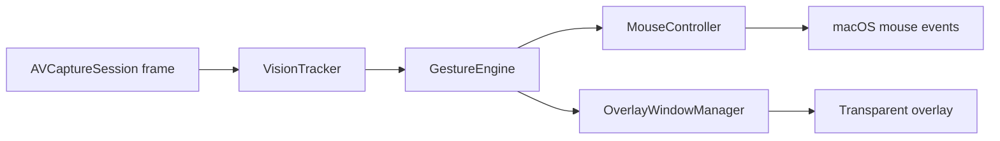

# AirDesk

AirDesk is a native macOS prototype for webcam-based hand tracking and gesture-driven cursor control. The current runtime is implemented in Swift with AVFoundation for camera capture, Vision for hand-pose tracking, AppKit/CoreGraphics for overlay and mouse integration, and SwiftPM for building and testing.

The original Python/OpenCV/MediaPipe prototype has been retired from this repository. Historical Python packaging, tests, and PyInstaller configuration were removed so the Swift package is the only supported runtime.

## Current Features

1. Captures live video from Desk View Camera when available, with fallback to the default webcam.
2. Detects one hand using Apple Vision hand-pose observations.
3. Mirrors normalized hand landmarks so motion feels natural on screen.
4. Smooths the index fingertip cursor with a One Euro filter.
5. Detects thumb-index pinch with hand-scale normalization, hysteresis, and debounce.
6. Shows a transparent click-through overlay with a visible trackpad region, camera preview, and cursor bloom.
7. Uses relative desk-trackpad motion by default, with live axis flips for camera orientation tuning.
8. Keeps real macOS mouse events disabled by default behind an explicit command-line safety gate.

## Requirements

1. macOS 14 or newer.
2. Xcode or Command Line Tools with Swift 6.2 or newer.
3. Camera permission for the process that launches AirDesk.
4. Accessibility permission only when real system mouse control is enabled.

## Build And Check

From the repository root:

```bash
cd AirDeskNative
swift build
swift run AirDeskChecks
```

## Run

Preview-only mode is the default and does not post system mouse events:

```bash
cd AirDeskNative
swift run AirDeskNative
```

To allow real macOS mouse control, opt in explicitly:

```bash
swift run AirDeskNative --enable-system-actions
```

To start with system control already armed:

```bash
swift run AirDeskNative --enable-system-actions --start-armed
```

When system actions are enabled, press `S` while AirDesk is focused to arm or disarm mouse-event posting. If the app is disarmed, hand tracking and the overlay continue to run, but no real mouse events are posted.

Runtime tuning keys:

```text
S  arm/disarm real mouse control
M  switch relative/absolute control mode
X  flip horizontal motion
Y  flip vertical motion
```

Relative mode is the default and is intended for desk-surface control. The first frame inside the trackpad zone anchors the hand; movement after that moves the cursor by delta, like a physical trackpad.

## Runtime Pipeline


```mermaid
flowchart LR
    A["AVCaptureSession frame"] --> B["VisionTracker"]
    B --> C["GestureEngine"]
    C --> D["MouseController"]
    C --> E["OverlayWindowManager"]
    D --> F["macOS mouse events"]
    E --> G["Transparent overlay"]
```

Each frame follows this flow:

1. `CameraManager` captures a BGRA video sample buffer.
2. `VisionTracker` runs `VNDetectHumanHandPoseRequest`.
3. `GestureEngine` smooths the index fingertip and computes pinch state.
4. `MouseController` maps desk-surface finger deltas into display movement and optionally posts mouse events.
5. `OverlayWindowManager` updates the trackpad visualization, camera preview, and cursor bloom.

## Project Layout

```text
AirDeskNative/
  Package.swift
  Sources/AirDeskNative/
    AirDeskNative.swift
  Sources/AirDeskChecks/
    main.swift
  Sources/AirDeskCore/
    CameraManager.swift
    CommandLineOptions.swift
    GestureEngine.swift
    MouseController.swift
    OneEuroFilter.swift
    OverlayWindow.swift
    VisionTracker.swift
```

## Safety Notes

Real mouse control is intentionally disabled unless `--enable-system-actions` is passed. `--start-armed` is rejected unless system actions are also enabled. Losing hand tracking, leaving the trackpad region, or disarming during a drag forces a mouse-up release to avoid leaving the system in a stuck drag state.

## Next Work

1. Package the Swift runtime as a signed `.app` bundle with camera usage metadata.
2. Add an in-app status/menu control for arming instead of relying only on the `S` key.
3. Add tuning controls for trackpad bounds, pinch thresholds, and smoothing.
4. Consider a small UI test harness with recorded hand-landmark fixtures.
